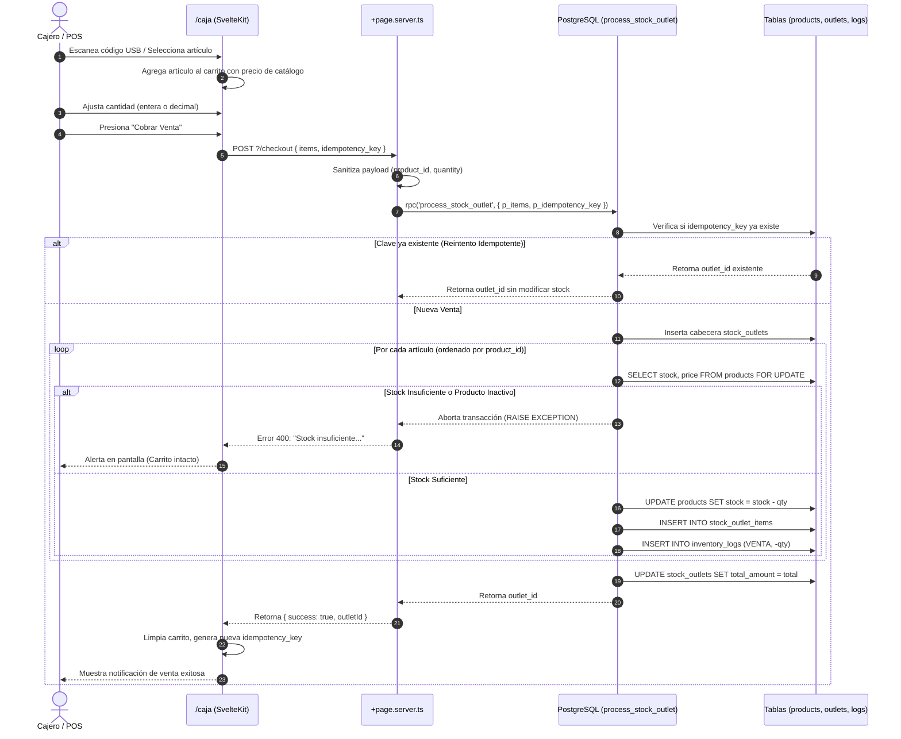
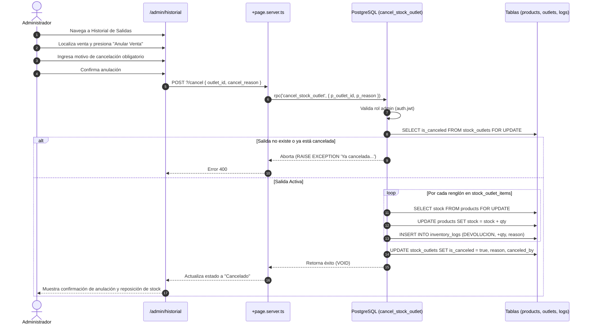

# Especificación Funcional del Sistema

**Sistema Web de Gestión de Inventario y Registro de Artículos (Punto de Venta — Papelería)**  
**Versión de Especificación:** 1.0 (Alineada a SRS v8.0)  
**Estado:** Documento Funcional Oficial de Producción  

---

## 1. Identidad del Producto

- **Nombre del Sistema:** Web App de Gestión de Inventario y Punto de Venta para Papelería (`inventario-papeleria`).
- **Propósito:** Proporcionar una solución web integral, ágil y confiable para la administración de catálogos, captura rápida de ventas en mostrador mediante escáner de códigos de barras USB, control de inventario con ventas fraccionadas, aislamiento confidencial de costos de adquisición y auditoría automática e inmutable de movimientos de almacén.
- **Problema que Resuelve:**
  1. *Fugas de información y confidencialidad:* Bloquea la exposición de márgenes y costos de compra al personal operativo (cajeros).
  2. *Discrepancias de inventario y errores humanos:* Elimina el desfase de existencias mediante transacciones atómicas e inmutables en base de datos.
  3. *Lentitud en mostrador:* Permite la venta mediante lectores USB con captura global resiliente y soporte de venta a granel/fraccionada (metros, decimales).
  4. *Falta de trazabilidad forense:* Registra cada salida y devolución sin permitir la alteración o borrado físico de registros históricos (*Soft Delete* estricto).
- **Tipo de Aplicación:** Aplicación web moderna (SPA/SSR) construida con SvelteKit (TypeScript, TailwindCSS) y backend serverless respaldado por Supabase Cloud (PostgreSQL 15, Auth, RLS y funciones PL/pgSQL).
- **Contexto de Uso:** Papelerías, librerías y comercios minoristas con venta de mostrador, lectores de código de barras y terminales de cobro.
- **Dentro del Alcance:**
  - Autenticación centralizada y control de acceso basado en roles (*RBAC*: Administrador y Cajero).
  - Terminal de Punto de Venta (POS) con captura global de escáner USB y teclado.
  - Carrito de compras reactivo con soporte de cantidades enteras y fraccionadas (`NUMERIC(10,3)`).
  - Cobro atómico e idempotente de ventas con cálculo de totales autoritativo en servidor/DB.
  - Gestión integral de catálogo: altas, ediciones, control de existencia y stock mínimo de alerta.
  - Gestión confidencial de costos unitarios de compra protegida por *Row Level Security* (RLS).
  - Bajas lógicas forzosas (*Soft Delete*: `is_active = false`) sin borrado físico `DELETE`.
  - Historial de salidas con consulta de partidas y cancelación/devolución exclusiva para administradores con reversión automática de stock.
  - Bitácora inmutable de auditoría de movimientos (`inventory_logs`).
  - Soporte de URLs externas para imágenes de productos (`image_url`).
- **Fuera del Alcance:**
  - Facturación electrónica fiscal (CFDI / SAT).
  - Terminales de cobro con tarjeta bancaria integradas vía hardware propietario (el sistema registra el cobro en caja; las transacciones bancarias se procesan externamente).
  - Pasarelas de pago para comercio electrónico (E-commerce público / tienda online).
  - Almacenamiento binario masivo de archivos de imágenes dentro del motor PostgreSQL.

---

## 2. Visión General del Sistema

El flujo general de operación de la aplicación sigue una arquitectura determinista y segura:

```
[Usuario] ──► [Inicio de Sesión] ──► [Evaluación de Rol (JWT / Server Hooks)]
                                                │
                 ┌──────────────────────────────┴──────────────────────────────┐
                 ▼                                                             ▼
         [Rol: Cajero]                                                 [Rol: Admin]
                 │                                                             │
         [Módulo: /caja]                                           [Módulos Administrativos]
                 │                                                (/admin/productos, /admin/historial,
                 │                                                 /admin/auditoria)
                 ▼                                                             │
   [Escaneo USB / Carrito / Cobro] ◄───────────────────────────────────────────┤
                 │                                                             │
                 ▼                                                             ▼
   [Transacción RPC Atómica]                                   [Gestión de Costos / Devolución / Catálogo]
   (process_stock_outlet)                                      (upsert_product_with_cost / cancel_stock_outlet)
                 │                                                             │
                 └──────────────────────────────┬──────────────────────────────┘
                                                ▼
                                    [Motor PostgreSQL]
                                 (Verificación de Stock,
                                  Descuento/Restitución,
                                  Auditoría Inmutable)
```

1. **Autenticación:** El usuario ingresa sus credenciales en `/login`. El servidor autentica la sesión y recupera el rol asignado (`app_metadata.role`).
2. **Enrutamiento por Rol:** El middleware del servidor (`hooks.server.ts`) valida el rol en cada solicitud: el cajero tiene acceso a la terminal de ventas (`/caja`), mientras que el administrador tiene acceso completo tanto a la caja como a los paneles de gestión (`/admin/*`).
3. **Operaciones Transaccionales:** Las acciones críticas (ventas, devoluciones, altas con costo) no se ejecutan mediante peticiones directas cliente-tabla, sino a través de Funciones Almacenadas en Servidor (*RPC* `SECURITY DEFINER`) que garantizan la atomicidad, validación de stock y consistencia total.
4. **Auditoría Automática:** Cada mutación física de inventario genera un registro inmutable en `inventory_logs` con fecha, usuario, tipo de cambio, cantidad y saldos anterior y posterior.

---

## 3. Actores del Sistema

### 3.1. Usuario No Autenticado (Público / Visitante)
- **Definición:** Cualquier usuario que accede a la aplicación sin una sesión activa o con credenciales inválidas.
- **Responsabilidades:** Ninguna.
- **Límites:** Bloqueado de todas las rutas de negocio (`/caja`, `/admin/*`). Solo puede visualizar la pantalla de inicio de sesión (`/login`). Cualquier intento de navegación protegida genera una redirección HTTP 303 a `/login`.

### 3.2. Cajero (Operador de Punto de Venta)
- **Definición:** Personal operativo encargado de la atención en mostrador, escaneo de artículos y cobro de ventas.
- **Responsabilidades:**
  - Escanear códigos de barras de artículos.
  - Seleccionar productos del catálogo activo y ajustar cantidades solicitadas.
  - Procesar el cobro atómico de la venta.
- **Límites:**
  - No puede visualizar costos de compra de productos ni márgenes de ganancia.
  - No puede crear, editar ni desactivar productos del catálogo.
  - No puede cancelar salidas ni procesar devoluciones de mercancía.
  - No puede acceder a las rutas `/admin/*` (redirigido inmediatamente a `/caja`).
  - No puede acceder a la bitácora de auditoría.

### 3.3. Administrador (Gerente / Supervisor del Negocio)
- **Definición:** Usuario con privilegios totales de administración, supervisión de inventario y control financiero.
- **Responsabilidades:**
  - Gestionar el catálogo de productos (altas, ediciones, precios, costos confidenciales y stock mínimo).
  - Dar de baja productos descontinuados mediante desactivación lógica (*Soft Delete*).
  - Supervisar el historial de todas las salidas y ventas de la tienda.
  - Procesar la cancelación de salidas y devolución de mercancía al stock con motivo documentado.
  - Consultar la bitácora inmutable de auditoría para trazabilidad operativa y análisis de mermas o ajustes.
  - Operar la caja y realizar ventas cuando sea necesario.
- **Límites:**
  - Sujeto a las políticas de integridad del sistema (no puede eliminar físicamente registros ni cancelar una venta más de una vez).

---

## 4. Matriz de Permisos (RBAC + RLS)

| Módulo / Operación | No Autenticado | Rol Cajero | Rol Administrador | Nivel de Ejecución / Validación |
| :--- | :---: | :---: | :---: | :--- |
| **Inicio de Sesión (`/login`)** | ✅ Permitido | ✅ Redirige a `/caja` | ✅ Redirige a `/caja` | `hooks.server.ts` |
| **Terminal de Caja (`/caja`)** | ❌ Redirige a `/login` | ✅ Permitido | ✅ Permitido | `hooks.server.ts` + SSR |
| **Consultar Catálogo Activo** | ❌ Denegado | ✅ Permitido | ✅ Permitido | PostgreSQL RLS (`products`) |
| **Registrar Venta** | ❌ Denegado | ✅ Permitido | ✅ Permitido | RPC `process_stock_outlet` |
| **Consultar Costos (`product_costs`)** | ❌ Denegado | ❌ **Bloqueado (RLS)** | ✅ Permitido | PostgreSQL RLS (`product_costs`) |
| **Crear / Editar Producto con Costo** | ❌ Denegado | ❌ **Bloqueado (403)** | ✅ Permitido | RPC `upsert_product_with_cost` |
| **Desactivar Producto (Soft Delete)** | ❌ Denegado | ❌ **Bloqueado (403)** | ✅ Permitido | PostgreSQL RLS (`products` UPDATE) |
| **Eliminación Física (SQL DELETE)** | ❌ **Prohibido** | ❌ **Prohibido** | ❌ **Prohibido** | Schema RLS (Sin política DELETE) |
| **Consultar Historial (`/admin/historial`)** | ❌ Redirige a `/login` | ❌ Redirige a `/caja` | ✅ Permitido | `hooks.server.ts` + PostgreSQL RLS |
| **Anular Venta / Devolución** | ❌ Denegado | ❌ **Bloqueado (RPC)** | ✅ Permitido | RPC `cancel_stock_outlet` |
| **Consultar Auditoría (`/admin/auditoria`)** | ❌ Redirige a `/login` | ❌ Redirige a `/caja` | ✅ Permitido | `hooks.server.ts` + PostgreSQL RLS |

---

## 5. Mapa de Módulos

### 5.1. `/login` — Autenticación de Usuarios
- **Objetivo:** Permitir el ingreso seguro al sistema validando correo electrónico y contraseña.
- **Usuario Autorizado:** Todos (No autenticados). Usuarios ya autenticados son redirigidos a `/caja`.
- **Información Mostrada:** Formulario de inicio de sesión con campos de correo y contraseña, indicador de carga y alertas de error por credenciales incorrectas.
- **Operaciones:** Validación de credenciales contra Supabase Auth y emisión de cookies de sesión segura HTTP-only.

### 5.2. `/caja` — Terminal de Punto de Venta (POS)
- **Objetivo:** Registro rápido de salidas e inventario mediante escáner de código de barras o búsqueda manual, gestión de carrito reactivo y cobro atómico.
- **Usuario Autorizado:** Cajero y Administrador.
- **Información Mostrada:**
  - Encabezado con estado activo del escáner USB e indicador de rol del usuario.
  - Barra de búsqueda y catálogo rápido de productos activos (miniatura de imagen, SKU, nombre, existencia y precio de venta).
  - Tabla de carrito de compras con desglose por partida: SKU, nombre, precio unitario, cantidad editable, subtotal y botón para eliminar renglón.
  - Resumen de venta con total acumulado y botón de cobro de alta visibilidad.
  - Notificaciones tipo *Toast* para confirmaciones de escaneo y alertas de éxito o error.
- **Operaciones:**
  - Captura global de ráfagas del lector de código de barras USB (<100ms).
  - Búsqueda manual por nombre o SKU directo.
  - Modificación de cantidades (enteras o fraccionadas).
  - Cobro atómico e idempotente invocando `process_stock_outlet`.

### 5.3. `/admin/productos` — Catálogo y Costos (Admin)
- **Objetivo:** Administración centralizada de artículos, precios públicos, costos confidenciales y niveles de stock de seguridad.
- **Usuario Autorizado:** Exclusivo Administrador.
- **Información Mostrada:**
  - Métricas de inventario (total de productos activos).
  - Barra de búsqueda en tiempo real por nombre o SKU.
  - Tabla interactiva: miniatura de imagen, nombre, descripción, SKU, precio de venta, costo de compra (destacado en ámbar), existencias actuales, stock mínimo de alerta, estado e indicador de stock bajo.
  - Botones de acción: "Nuevo Producto", "Editar" y "Desactivar".
- **Operaciones:**
  - Alta atómica de producto con costo mediante `ProductModal` y RPC `upsert_product_with_cost`.
  - Edición de productos existentes y sus costos unitarios.
  - Asignación de URL de imagen (`image_url`).
  - Baja lógica (*Soft Delete*) de productos descontinuados.

### 5.4. `/admin/historial` — Historial de Salidas y Cancelaciones (Admin)
- **Objetivo:** Consulta y supervisión de todas las ventas procesadas en el sistema, con capacidad de cancelación justificada.
- **Usuario Autorizado:** Exclusivo Administrador.
- **Información Mostrada:**
  - Métricas de ventas: total de salidas, importe acumulado activo y total de cancelaciones.
  - Buscador por folio de venta o identificador.
  - Tabla de salidas: folio serial, fecha/hora, cajero/vendedor, importe total, estado (Vendido / Cancelado), fecha de cancelación, usuario que canceló y motivo.
  - Vista modal de detalle: lista de renglones vendidos (producto, cantidad, precio unitario y subtotal cobrado).
- **Operaciones:**
  - Inspección detallada de partidas de cualquier salida histórica.
  - Cancelación de salida con motivo obligatorio vía RPC `cancel_stock_outlet`.

### 5.5. `/admin/auditoria` — Bitácora Inmutable de Auditoría (Admin)
- **Objetivo:** Consulta de trazabilidad forense de todas las mutaciones de existencias en el inventario.
- **Usuario Autorizado:** Exclusivo Administrador.
- **Información Mostrada:**
  - Filtro por tipo de movimiento (`VENTA`, `DEVOLUCION`, `REABASTECIMIENTO`, `AJUSTE_MANUAL`, `MERMA`).
  - Tabla cronológica: fecha/hora exacta, nombre del producto, código SKU, tipo de movimiento con distintivo de color, stock previo, cantidad alterada (positiva en devoluciones/entradas, negativa en ventas), stock resultante, usuario responsable y notas descriptivas.
- **Operaciones:** Consulta de solo lectura (los registros son insertados exclusivamente por triggers y RPCs; no existen endpoints de edición o borrado).

---

## 6. Casos de Uso del Sistema

```mermaid
graph TD
    subgraph Actores
        A[Administrador]
        C[Cajero]
        U[Usuario No Autenticado]
    end

    subgraph Casos de Uso
        CU01(CU-01 Iniciar Sesión)
        CU02(CU-02 Realizar Venta)
        CU03(CU-03 Buscar Producto)
        CU04(CU-04 Agregar al Carrito)
        CU05(CU-05 Modificar Cantidad)
        CU06(CU-06 Venta Fraccionada)
        CU07(CU-07 Procesar Cobro)
        CU08(CU-08 Reintentar Venta Idempotente)
        CU09(CU-09 Crear Producto con Costo)
        CU10(CU-10 Editar Producto y Costo)
        CU11(CU-11 Asignar image_url)
        CU12(CU-12 Soft Delete Producto)
        CU13(CU-13 Consultar Costos)
        CU14(CU-14 Consultar Historial)
        CU15(CU-15 Detalle de Venta)
        CU16(CU-16 Cancelar / Devolver Venta)
        CU17(CU-17 Consultar Auditoría)
        CU18(CU-18 Acceso No Autorizado)
    end

    U --> CU01
    U --> CU18
    C --> CU01
    C --> CU02
    C --> CU03
    C --> CU04
    C --> CU05
    C --> CU06
    C --> CU07
    C --> CU08
    C --> CU18
    A --> CU01
    A --> CU02
    A --> CU07
    A --> CU09
    A --> CU10
    A --> CU11
    A --> CU12
    A --> CU13
    A --> CU14
    A --> CU15
    A --> CU16
    A --> CU17
```



### CU-01: Iniciar Sesión
- **Actor:** Cajero / Administrador.
- **Precondiciones:** Usuario registrado previamente en el sistema.
- **Flujo Principal:**
  1. El usuario accede a `/login`.
  2. Ingresa su correo electrónico y contraseña.
  3. Presiona el botón "Iniciar Sesión".
  4. El sistema valida las credenciales contra Supabase Auth.
  5. Se emite la cookie de sesión y se deriva el rol (`admin` o `cajero`).
  6. El sistema redirige automáticamente a `/caja`.
- **Resultado:** Sesión iniciada con permisos correspondientes.
- **Errores:** Si las credenciales son inválidas, se muestra el mensaje "Credenciales inválidas. Verifique su correo y contraseña" y no se otorga acceso.

### CU-02: Realizar Venta
- **Actor:** Cajero / Administrador.
- **Precondiciones:** Sesión iniciada; catálogo con productos activos.
- **Flujo Principal:**
  1. El usuario escanea el código de barras con el lector USB o selecciona productos del catálogo rápido.
  2. Los artículos se agregan al carrito con su precio oficial de base de datos.
  3. Se ajustan las cantidades requeridas.
  4. Se presiona el botón "Cobrar Venta".
  5. El sistema descuenta el stock, registra la salida, genera los registros de auditoría y limpia el carrito.
- **Resultado:** Venta completada con folio emitido y stock descontado.

### CU-03: Buscar Producto
- **Actor:** Cajero / Administrador.
- **Precondiciones:** Estar en `/caja` o en `/admin/productos`.
- **Flujo Principal:**
  1. El usuario escribe un término en la barra de búsqueda (nombre o SKU).
  2. La vista filtra reactivamente los productos coincidentes en tiempo real.
- **Resultado:** Lista filtrada según el criterio ingresado.

### CU-04: Agregar Producto al Carrito
- **Actor:** Cajero / Administrador.
- **Precondiciones:** Estar en la terminal `/caja`.
- **Flujo Principal:**
  1. El lector USB detecta un código de barras o el usuario hace clic en una tarjeta de producto.
  2. Si el producto ya existe en el carrito, se incrementa su cantidad en +1.
  3. Si no existe, se inserta una nueva fila con cantidad inicial 1.
  4. Se actualiza el subtotal del renglón y el total general de la venta.
- **Resultado:** Carrito actualizado y notificación breve en pantalla.

### CU-05: Modificar Cantidad
- **Actor:** Cajero / Administrador.
- **Precondiciones:** Carrito con al menos un artículo.
- **Flujo Principal:**
  1. El usuario edita directamente el campo numérico de cantidad en la fila del carrito.
  2. El sistema recalcula en tiempo real el subtotal de la partida (`cantidad * precio`) y el total de la venta.
- **Resultado:** Cantidad modificada con recálculo instantáneo.
- **Alternativa:** Si el usuario ingresa 0 o presiona el botón de eliminar, el artículo se retira del carrito.

### CU-06: Realizar Venta con Cantidad Fraccionada
- **Actor:** Cajero / Administrador.
- **Precondiciones:** Venta de artículos por medida (ej. papel, cinta, listón por metro).
- **Flujo Principal:**
  1. Se agrega el producto al carrito.
  2. El usuario ingresa una cantidad decimal (ej. `1.750` o `0.500`).
  3. El sistema valida el formato numérico con precisión de 3 decimales (`NUMERIC(10,3)`).
  4. El cobro descuenta la fracción exacta del inventario.
- **Resultado:** Descuento fraccionario exacto en existencias sin truncamientos indeseados.

### CU-07: Procesar Cobro
- **Actor:** Cajero / Administrador.
- **Precondiciones:** Carrito con al menos un artículo y existencias disponibles.
- **Flujo Principal:**
  1. El usuario presiona el botón "Cobrar Venta ($Total)".
  2. El frontend envía los artículos (`product_id`, `quantity`) y un identificador único `idempotency_key` (UUID).
  3. El servidor ejecuta la RPC `process_stock_outlet`.
  4. La base de datos bloquea las filas (`FOR UPDATE`), verifica stock suficiente de todos los renglones, calcula el total con precios de BD, descuenta el stock, inserta `stock_outlets`, `stock_outlet_items` y `inventory_logs` tipo `VENTA`.
  5. El servidor retorna el ID de la salida.
  6. El carrito se vacía y se muestra un banner de confirmación con el folio e importe cobrado.
- **Resultado:** Transacción consolidada en una sola operación atómica.

### CU-08: Reintentar una Operación sin Duplicar la Venta (Idempotencia)
- **Actor:** Cajero / Administrador.
- **Precondiciones:** Falla de red o doble clic durante el procesamiento del cobro.
- **Flujo Principal:**
  1. El cliente envía la solicitud con una `idempotency_key` generada para ese intento.
  2. Si la conexión se interrumpe y el cliente reenvía la misma clave, la función `process_stock_outlet` detecta que la clave ya existe en `stock_outlets`.
  3. La RPC retorna el ID de la salida ya registrada sin volver a descontar el stock ni duplicar registros.
- **Resultado:** Protección estricta contra cobros dobles y desajustes de stock.

### CU-09: Crear Producto con Costo Confidencial
- **Actor:** Administrador.
- **Precondiciones:** Sesión con rol `admin`; estar en `/admin/productos`.
- **Flujo Principal:**
  1. El administrador presiona "+ Nuevo Producto".
  2. Ingresa SKU, nombre, descripción opcional, precio de venta, costo confidencial de compra, stock inicial, stock mínimo y URL de imagen opcional.
  3. Presiona "Crear Producto".
  4. El servidor ejecuta `upsert_product_with_cost`.
  5. Se inserta el producto en `products` y su costo en `product_costs` de forma atómica.
  6. Se cierra la modal y la tabla se actualiza.
- **Resultado:** Producto registrado y disponible para venta en caja; costo almacenado confidencialmente.

### CU-10: Editar Producto y Costo
- **Actor:** Administrador.
- **Precondiciones:** Sesión con rol `admin`; producto existente en catálogo.
- **Flujo Principal:**
  1. El administrador hace clic en "Editar" en la fila del producto deseado.
  2. La modal carga todos los valores vigentes (incluyendo el costo confidencial).
  3. Modifica los campos necesarios (ej. actualizar precio de venta o stock).
  4. Presiona "Guardar Cambios".
  5. La RPC `upsert_product_with_cost` ejecuta un `ON CONFLICT (id) DO UPDATE` en ambas tablas.
- **Resultado:** Producto y costo actualizados de forma simultánea.

### CU-11: Asignar / Actualizar URL de Imagen
- **Actor:** Administrador.
- **Precondiciones:** Estar creando o editando un producto en `ProductModal`.
- **Flujo Principal:**
  1. En el campo "URL de Imagen", ingresa una dirección web válida (ej. `https://dominio.com/foto.jpg`).
  2. Guarda el producto.
  3. La URL se almacena en `products.image_url`.
- **Resultado:** La imagen se renderiza en la tabla de productos del panel admin y en las tarjetas del catálogo rápido de Caja.

### CU-12: Desactivar Producto mediante Soft Delete
- **Actor:** Administrador.
- **Precondiciones:** Sesión con rol `admin`; producto activo en catálogo.
- **Flujo Principal:**
  1. El administrador hace clic en "Desactivar" en la fila del producto.
  2. Confirma el cuadro de diálogo de seguridad.
  3. El servidor ejecuta un `UPDATE products SET is_active = false`.
  4. El producto desaparece inmediatamente de la terminal de Caja y de la vista activa del administrador.
  5. El registro físico permanece en PostgreSQL para preservar llaves foráneas de ventas pasadas.
- **Resultado:** Producto retirado de la venta sin destruir la integridad relacional histórica.

### CU-13: Consultar Costos Confidenciales
- **Actor:** Administrador.
- **Precondiciones:** Sesión activa con rol `admin`.
- **Flujo Principal:**
  1. El administrador accede a `/admin/productos`.
  2. El servidor consulta `product_costs` mediante RLS y vincula los costos a cada producto.
  3. La columna "Costo (Admin)" muestra el costo unitario de compra de cada artículo.
- **Resultado:** Visualización clara de márgenes para la gestión del negocio.

### CU-14: Consultar Historial de Salidas
- **Actor:** Administrador.
- **Precondiciones:** Sesión con rol `admin`; estar en `/admin/historial`.
- **Flujo Principal:**
  1. El administrador accede al módulo de historial.
  2. Visualiza la lista de todas las salidas con folio, fecha, cajero, total y estado.
- **Resultado:** Supervisión completa de transacciones pasadas.

### CU-15: Consultar Detalle de Venta
- **Actor:** Administrador.
- **Precondiciones:** Salida registrada en `/admin/historial`.
- **Flujo Principal:**
  1. El administrador hace clic en "Ver Partidas" en la salida seleccionada.
  2. La ventana modal desglosa los artículos vendidos, cantidades exactas, precios unitarios cobrados y subtotales.
- **Resultado:** Detalle forense de la composición de la venta.

### CU-16: Cancelar / Devolver una Venta
- **Actor:** Administrador.
- **Precondiciones:** Venta activa (no cancelada previamente); sesión con rol `admin`.
- **Flujo Principal:**
  1. En `/admin/historial`, el administrador localiza la salida y presiona "Anular Venta".
  2. Ingresa obligatoriamente el motivo de cancelación (ej. "Devolución por producto defectuoso").
  3. Presiona "Confirmar Anulación".
  4. La RPC `cancel_stock_outlet` verifica que la venta no esté cancelada, recorre cada renglón en `stock_outlet_items`, suma la cantidad vendida al stock de cada producto (`stock = stock + qty`), inserta registros en `inventory_logs` con tipo `DEVOLUCION` y marca `is_canceled = true`, `canceled_at`, `canceled_by` y `cancel_reason`.
- **Resultado:** Stock restaurado inmediatamente, venta marcada como cancelada y trazabilidad auditada.

### CU-17: Consultar Auditoría Inmutable
- **Actor:** Administrador.
- **Precondiciones:** Sesión con rol `admin`; estar en `/admin/auditoria`.
- **Flujo Principal:**
  1. El administrador accede a la bitácora de auditoría.
  2. Consulta la lista cronológica o filtra por tipo de movimiento (`VENTA`, `DEVOLUCION`, etc.).
- **Resultado:** Inspección forense de variaciones de stock, usuarios responsables y notas del sistema.

### CU-18: Intentar Acceder a una Función sin Autorización
- **Actor:** Usuario No Autenticado o Cajero.
- **Flujo:**
  - Si un usuario no autenticado intenta acceder a `/caja` o `/admin/*`, el middleware lo redirige (HTTP 303) a `/login`.
  - Si un cajero intenta acceder a `/admin/*`, el middleware lo redirige (HTTP 303) a `/caja`.
  - Si un cajero intenta invocar directamente las RPCs administrativas (`upsert_product_with_cost`, `cancel_stock_outlet`), la función en PostgreSQL lanza una excepción `RAISE EXCEPTION 'Solo un Administrador puede...'` y aborta la transacción.
  - Si un cajero intenta consultar `product_costs` mediante la API de Supabase, las políticas RLS retornan 0 filas.
- **Resultado:** Bloqueo total en múltiples capas (SSR, API y Base de Datos).

---

## 7. Reglas de Negocio

1. **RN-01: Aislamiento Estricto de Roles (RBAC):** Existen únicamente dos roles en el sistema: `admin` y `cajero`. La derivación del rol se realiza a través de `auth.users.raw_app_meta_data.role`. El primer usuario registrado en la base de datos recibe automáticamente el rol `admin`; los siguientes reciben `cajero`.
2. **RN-02: Confidencialidad Absoluta de Costos:** La tabla `product_costs` está protegida por RLS estricto (`auth.jwt() -> 'app_metadata' ->> 'role' = 'admin'`). Ningún cajero puede consultar ni inferir los costos de compra ni márgenes de utilidad.
3. **RN-03: Prohibición de Borrado Físico (*Soft Delete* Obligatorio):** Queda prohibida la instrucción `DELETE` en la tabla `products`. Para retirar un producto del catálogo, se actualiza `is_active = false`. Esto protege la integridad relacional con `stock_outlet_items` e `inventory_logs`.
4. **RN-04: Atomicidad Transaccional:** El procesamiento de ventas y devoluciones opera bajo el principio de "todo o nada". Si un solo producto de una venta múltiple carece de existencias, la transacción completa falla y ningún producto es descontado.
5. **RN-05: Idempotencia en Ventas:** Cada solicitud de cobro en `/caja` incluye un `idempotency_key` (UUID). Si la red se interrumpe y la petición se reintenta, el sistema detecta la clave y devuelve la salida existente sin duplicar el descuento de stock.
6. **RN-06: Precios Autoritativos de Base de Datos:** Los precios unitarios enviados por el cliente o navegador son completamente ignorados durante el cobro. La RPC `process_stock_outlet` lee directamente el campo `price` de la tabla `products` en PostgreSQL al momento de consolidar la venta.
7. **RN-07: Soporte de Cantidades Fraccionadas:** El campo `stock` y las cantidades en ventas manejan el tipo de dato `NUMERIC(10,3)` para permitir la venta por metro, pliego o fracción (ej. 0.500 m de papel).
8. **RN-08: Validación de Existencias Positivas:** Las existencias nunca pueden quedar en números negativos (`stock >= 0`). Si la cantidad solicitada supera el stock disponible, la RPC aborta con un mensaje descriptivo indicando el stock disponible vs el solicitado.
9. **RN-09: Cancelación Exclusiva de Administrador:** Solo un usuario con rol `admin` puede cancelar salidas mediante `cancel_stock_outlet`. La cancelación restituye automáticamente el stock de todos los artículos de la venta.
10. **RN-10: Imposibilidad de Doble Cancelación:** Una venta ya cancelada (`is_canceled = true`) no puede volver a cancelarse bajo ninguna circunstancia.
11. **RN-11: Auditoría Automática Inmutable:** Cada venta genera registros tipo `VENTA` en `inventory_logs`. Cada cancelación genera registros tipo `DEVOLUCION`. Los cambios manuales de stock disparan un trigger automático `AFTER UPDATE` que genera registros tipo `REABASTECIMIENTO` o `AJUSTE_MANUAL`.
12. **RN-12: Manejo de Imágenes por URL:** Las imágenes de producto se referencian mediante una URL externa guardada en `products.image_url` (tipo `TEXT`, opcional). No se almacenan blobs binarios en la base de datos.

---

## 8. Flujo Completo de Venta (Paso a Paso)



---

## 9. Flujo Completo de Devolución / Cancelación



---

## 10. Flujo y Ciclo de Vida de Productos

```
       [Creación]
(SKU, Nombre, Precio,
 Costo Admin, Stock,
 Min Stock, Image URL)
          │
          ▼
   [Estado: ACTIVO] ◄──────────────────────┐
 (is_active = true)                        │
          │                                │ (Reactivación vía UPDATE
          ├── Disponible en Caja           │  en Base de Datos)
          ├── Editable por Admin           │
          └── Consultable en Catálogo      │
          │                                │
          ▼ (Desactivar / Soft Delete)     │
  [Estado: INACTIVO] ──────────────────────┘
 (is_active = false)
          │
          ├── Oculto en terminal de Caja
          ├── Bloqueado para nuevas ventas en RPC
          └── Conservado físicamente en PostgreSQL
              (Preserva historial y reportes)
```

---

## 11. Flujo de Imágenes de Producto

1. **Almacenamiento por Referencia:** El sistema almacena exclusivamente la cadena URL en la columna `products.image_url` (tipo `TEXT`). No se guardan archivos binarios dentro de PostgreSQL.
2. **Naturaleza Opcional:** El campo `image_url` es opcional (admite `NULL`).
3. **Consistencia:**
   - Si `image_url` contiene una URL, la interfaz administrativa (`/admin/productos`) y la terminal de ventas (`/caja`) muestran la imagen mediante la etiqueta ``.
   - Si `image_url` es `NULL` o está vacío, ambas pantallas renderizan automáticamente un icono SVG estándar de imagen como marcador de posición.
4. **Supabase Storage:** El SRS v8.0 menciona Supabase Storage como componente del stack general, pero la especificación funcional y el esquema DDL establecen que la entidad producto opera mediante enlaces `image_url`. La subida directa de archivos mediante buckets queda reservada como mejora futura sin afectar el cumplimiento del SRS.

---

## 12. Integración con Escáner de Códigos de Barras USB

- **Modo de Operación:** Dispositivos lectores de código de barras USB configurados en modo emulación de teclado (*USB HID / Keyboard Wedge*).
- **Detección por Ráfaga Temporal:** El componente `BarcodeScanner.svelte` y su manejador `ScannerHandler` interceptan pulsaciones globales a nivel de ventana (`window.addEventListener('keydown')`).
- **Criterio de Ráfaga (<100ms):** Los caracteres ingresados con un intervalo menor a 100ms se identifican como procedentes del hardware lector y se acumulan en un buffer interno. Si el usuario escribe manualmente en el teclado a velocidad normal (>=100ms), el buffer se descarta para evitar falsos positivos.
- **Terminador `Enter`:** Al recibir el carácter `Enter`, el escáner emite el código SKU completo acumulado y dispara el evento `onScan(sku)`.
- **Independencia de Foco:** El escaneo funciona sin importar dónde esté posicionado el cursor del usuario en la pantalla de `/caja`.

---

## 13. Modelo de Inventario y Movimientos

- **Existencia Inicial / Entrada:** Al crear un producto o editarlo en `/admin/productos`, se define la cantidad disponible.
- **Salida de Almacén:** Cada venta consolidada en `/caja` reduce el stock en la cantidad exacta (`stock = stock - cantidad`).
- **Restitución por Devolución:** Cada venta anulada en `/admin/historial` reintegra la mercancía al inventario (`stock = stock + cantidad`).
- **Umbral de Alerta (`min_stock`):** Cuando `stock <= min_stock`, la fila del producto en `/admin/productos` muestra una etiqueta visual ámbar con icono de advertencia para indicar la necesidad de reabastecimiento.

---

## 14. Bitácora Inmutable de Auditoría (`inventory_logs`)

- **Estructura:** Cada registro almacena `id`, `product_id`, `change_type`, `previous_stock`, `new_stock`, `quantity_changed`, `reference_id` (ID de la salida o devolución), `created_by` (UUID del usuario autenticado), `notes` y `created_at`.
- **Tipos de Movimiento:**
  - `VENTA`: Salida generada por cobro en caja (cantidad negativa).
  - `DEVOLUCION`: Entrada generada por anulación de salida por el administrador (cantidad positiva).
  - `REABASTECIMIENTO`: Entrada manual de stock vía catálogo (`new_stock > previous_stock`).
  - `AJUSTE_MANUAL`: Ajuste manual de stock a la baja vía catálogo (`new_stock < previous_stock`).
  - `MERMA`: Registro reservado para bajas por daño o merma justificada.
- **Naturaleza:** Los registros son de **solo lectura**. No existen endpoints ni permisos en RLS para modificar (`UPDATE`) ni borrar (`DELETE`) filas en `inventory_logs`.

---

## 15. Seguridad y Control de Acceso

- **Autenticación:** Gestionada mediante Supabase Auth con tokens JWT criptográficamente firmados y cookies de sesión HTTP-only.
- **Guardias en Servidor (`hooks.server.ts`):** Inspección estricta de rutas en cada ciclo de vida SSR:
  - `/admin/*` requiere usuario autenticado y `locals.role === 'admin'`.
  - `/caja/*` requiere usuario autenticado.
- **Políticas RLS en Base de Datos:**
  - `products`: Lectura pública para usuarios autenticados; escritura exclusiva para `admin`.
  - `product_costs`: Lectura y escritura exclusiva para `admin`.
  - `stock_outlets`: Lectura de salidas propias para cajeros; lectura y cancelación total para `admin`.
  - `inventory_logs`: Lectura exclusiva para `admin`.
- **Seguridad en Funciones (Definer):** Las RPCs críticas utilizan `SECURITY DEFINER SET search_path = public` y evalúan internamente el rol antes de procesar operaciones privilegiadas.
- **Protección de Credenciales:** La clave de servicio (`service_role`) no se utiliza en la aplicación cliente ni en el backend de SvelteKit. El archivo `.env.local` con credenciales reales está estrictamente excluido del repositorio en `.gitignore`.

---

## 16. Manejo de Errores y Comportamiento del Sistema

| Escenario de Error | Capa que Detecta | Comportamiento del Sistema | Mensaje Mostrado al Usuario |
| :--- | :--- | :--- | :--- |
| **Credenciales inválidas en Login** | Supabase Auth / Server | Retorna código 400 y mantiene el formulario activo. | "Credenciales inválidas. Verifique su correo y contraseña." |
| **Stock insuficiente en cobro** | RPC PostgreSQL | Aborta la transacción completa; no descuenta ningún artículo; conserva el carrito y el `idempotency_key`. | "Stock insuficiente para ID [UUID]. Disponible: X, Solicitado: Y." |
| **Cajero intenta acceder a `/admin/*`** | Middleware `hooks.server.ts` | Intercepta la solicitud SSR y emite redirección HTTP 303 inmediata. | Redirigido a `/caja`. |
| **Cajero intenta invocar RPC Admin** | RPC PostgreSQL | Lanza excepción PL/pgSQL y rechaza la ejecución. | "Solo un Administrador puede modificar el catálogo / cancelar salidas." |
| **Venta de producto desactivado** | RPC PostgreSQL | La consulta `FOR UPDATE` filtra `is_active = true`; si está inactivo, aborta la venta. | "Producto ID [UUID] inactivo o inexistente." |
| **Intento de doble anulación de venta** | RPC PostgreSQL | Detecta `is_canceled = true` y aborta la transacción. | "La salida no existe o ya fue cancelada previamente." |
| **SKU duplicado al crear producto** | Constraint Unique PostgreSQL | Captura el error en la acción de SvelteKit y lo expone en la modal. | "Error al guardar el producto. Verifique que el código SKU no esté duplicado." |
| **Carrito vacío al cobrar** | Acción SvelteKit | Valida longitud del arreglo antes de invocar la base de datos. | "El carrito debe tener al menos un producto." |

---

## 17. Diagrama de Autenticación y Flujo RBAC

```mermaid
flowchart TD
    Inicio([Petición del Navegador]) --> EvalRuta{¿Ruta Solicitada?}
    
    EvalRuta -->|/login| EvalLoginAuth{¿Sesión Activa?}
    EvalLoginAuth -->|Sí| RedirCaja[Redirección 303 a /caja]
    EvalLoginAuth -->|No| MostrarLogin[Mostrar Formulario de Login]
    
    EvalRuta -->|/caja/*| EvalCajaAuth{¿Sesión Activa?}
    EvalCajaAuth -->|No| RedirLogin[Redirección 303 a /login]
    EvalCajaAuth -->|Sí| RenderCaja[Renderizar Terminal de Punto de Venta]
    
    EvalRuta -->|/admin/*| EvalAdminAuth{¿Sesión Activa?}
    EvalAdminAuth -->|No| RedirLogin
    EvalAdminAuth -->|Sí| EvalAdminRol{¿Rol === 'admin'?}
    EvalAdminRol -->|No (Cajero)| RedirCaja
    EvalAdminRol -->|Sí (Admin)| RenderAdmin[Renderizar Módulo Administrativo]
```

---

## 18. Estado Funcional Actual

| Módulo / Característica | Estado | Evidencia de Implementación | Cobertura de Tests |
| :--- | :--- | :--- | :--- |
| **Autenticación y Sesiones** | **Implementado y Probado** | `src/routes/login/`, `src/hooks.server.ts` | `tests/auth/route_guards.test.ts` (13 tests) |
| **Route Guards y RBAC** | **Implementado y Probado** | `src/hooks.server.ts` | `tests/auth/route_guards.test.ts` |
| **Terminal de Cobro (POS)** | **Implementado y Probado** | `src/routes/caja/`, `CartTable.svelte` | `tests/ui/scanner_checkout.test.ts` (10 tests) |
| **Escáner USB (<100ms)** | **Implementado y Probado** | `BarcodeScanner.svelte` | `tests/ui/scanner_dom_lifecycle.test.ts` (6 tests) |
| **RPC Venta Atómica** | **Implementado y Probado** | `process_stock_outlet` en SQL | `tests/db/process_outlet.test.ts` (6 tests) |
| **Idempotencia de Venta** | **Implementado y Probado** | `idempotency_key` en SQL y Server | `tests/db/process_outlet.test.ts` |
| **Ventas Fraccionadas** | **Implementado y Probado** | `NUMERIC(10,3)` en esquema y UI | `tests/db/process_outlet.test.ts` |
| **Catálogo de Productos** | **Implementado y Probado** | `src/routes/admin/productos/` | `tests/ui/admin_products.test.ts` (9 tests) |
| **Aislamiento de Costos RLS** | **Implementado y Probado** | `product_costs` + RLS en SQL | `tests/db/rls_costs.test.ts` (6 tests) |
| **RPC Alta/Edición con Costo** | **Implementado y Probado** | `upsert_product_with_cost` en SQL | `tests/db/rls_costs.test.ts` |
| **Soft Delete Obligatorio** | **Implementado y Probado** | `is_active = false` en SQL y UI | `tests/db/rls_costs.test.ts` |
| **Historial y Cancelación** | **Implementado y Probado** | `src/routes/admin/historial/` | `tests/ui/returns_audit.test.ts` (8 tests) |
| **RPC Devolución Atómica** | **Implementado y Probado** | `cancel_stock_outlet` en SQL | `tests/db/cancel_outlet.test.ts` (6 tests) |
| **Auditoría Inmutable** | **Implementado y Probado** | `inventory_logs` + Triggers en SQL | `tests/ui/returns_audit.test.ts` |
| **Referencia de Imágenes** | **Implementado** | `image_url` en SQL, Admin y Caja | `tests/ui/admin_products.test.ts` |
| **Integración Cloud Real** | **Implementado y Probado** | Supabase Cloud PostgreSQL + Auth | `tests/cloud/supabase_cloud.test.ts` (7 tests) |
| **Flujo E2E Crítico** | **Implementado y Probado** | Playwright con navegador Chromium | `tests/e2e/pos_critical_flow.spec.ts` (1 suite) |

---

## 19. Registro de Mejoras Futuras / UX (Backlog)

Las siguientes mejoras fueron identificadas durante auditorías técnicas y pruebas manuales. Se registran formalmente como **mejoras futuras**, no como defectos funcionales del SRS v8.0:

1. **Redirección Automática de la Ruta Raíz (`/`):** Configurar `src/hooks.server.ts` o `src/routes/+page.server.ts` para que la raíz `/` redirija automáticamente a `/caja` (si hay sesión activa) o a `/login` (si no está autenticado), reemplazando la plantilla inicial estándar de SvelteKit.
2. **Dashboard / Menú Principal para Administradores:** Implementar un panel de inicio administrativo en `/admin` con accesos rápidos a productos, historial, auditoría y métricas consolidadas del día.
3. **Barra de Navegación Global (Header):** Añadir una barra de navegación común en el layout principal que permita alternar cómodamente entre `/caja`, `/admin/productos`, `/admin/historial` y `/admin/auditoria` con un botón de cierre de sesión (*Logout*) visible.
4. **Vista Previa de Imagen en Modal de Producto:** Añadir un recuadro de previsualización en tiempo real (`` reactivo con validación `onerror`) dentro de `ProductModal.svelte` mientras el administrador escribe la URL de imagen.
5. **Gestor de Productos Desactivados:** Añadir un filtro en `/admin/productos` para listar productos inactivos y permitir su reactivación con un clic.
6. **Subida de Archivos con Supabase Storage:** Implementar un selector de archivos (*file picker*) que cargue imágenes directamente a un bucket público de Supabase Storage y genere automáticamente la URL de almacenamiento.

---

## 20. Cuentas y Configuración de Pruebas

Para ejecutar pruebas manuales o automatizadas, el sistema utiliza dos cuentas preconfiguradas:

- **Administrador:**
  - Correo electrónico: `admin@papeleria.com`
  - Contraseña: Configurada mediante la variable `TEST_ADMIN_PASSWORD` en el archivo local `.env.local`.
- **Cajero:**
  - Correo electrónico: `cajero@papeleria.com`
  - Contraseña: Configurada mediante la variable `TEST_CAJERO_PASSWORD` en el archivo local `.env.local`.

> 🔒 **Aviso de Seguridad:** Por estándares de seguridad y protección de datos, las contraseñas reales nunca forman parte del código fuente ni de este repositorio. Cada desarrollador o implementador debe configurar su propio archivo `.env.local` basándose en `.env.example`.

---

## 21. Evidencia y Línea Base de Testing

El sistema cuenta con una suite completa de pruebas automatizadas que validan cada capa de la arquitectura:

- **Vitest (Unitarias e Integración):**
  - **Resultado:** `85 passed | 0 failed | 1 skipped` (86 tests totales).
  - Valida algoritmos de captura de escáner (<100ms), cálculo de subtotales fraccionados, guardias de servidor en SvelteKit, validaciones de formularios y transacciones en base de datos PostgreSQL real.
- **Pruebas de Integración en Supabase Cloud (`tests/cloud/`):**
  - **Resultado:** `7 passed | 0 failed | 0 skipped`.
  - Valida la conectividad a la instancia remota de Supabase Cloud, autenticación real con JWT, aislamiento RLS de costos y ejecución de las tres funciones RPC (`upsert_product_with_cost`, `process_stock_outlet`, `cancel_stock_outlet`).
- **Pruebas End-to-End con Playwright (`tests/e2e/`):**
  - **Resultado:** `1 passed (11.0s)` en navegador Chromium real.
  - Valida el flujo crítico completo de extremo a extremo: inicio de sesión como cajero, escaneo/búsqueda de producto, adición al carrito, ejecución del cobro atómico y verificación del descuento de existencias.

---

## 22. Matriz de Trazabilidad frente a Requisitos SRS v8.0

| Requisito SRS v8.0 | Descripción | Implementación en Código | Evidencia de Test | Estado |
| :--- | :--- | :--- | :--- | :---: |
| **SRS-01** | Catálogo con sku_code, name, price, stock (NUMERIC(10,3)), min_stock, image_url, is_active | `supabase/migrations/20260829000000_init_v8.sql` (Líneas 28-40) | `tests/db/rls_costs.test.ts` | **CUMPLE** |
| **SRS-02** | Aislamiento confidencial de costos en `product_costs` protegido por RLS | `product_costs` table + RLS policy (Líneas 43-47, 126-127) | `tests/db/rls_costs.test.ts` | **CUMPLE** |
| **SRS-03** | Prohibición de borrado físico (`DELETE`) mediante Soft Delete obligatorio | Ausencia de política DELETE + `is_active = false` en `+page.server.ts` | `tests/db/rls_costs.test.ts` | **CUMPLE** |
| **SRS-04** | RPC de Alta/Edición atómica `upsert_product_with_cost` | Función SQL PL/pgSQL (Líneas 144-182) | `tests/db/rls_costs.test.ts`, `tests/cloud/` | **CUMPLE** |
| **SRS-05** | Auditoría automática por trigger en cambios manuales de stock | Trigger `trg_audit_product_stock` + `log_product_stock_changes` (Líneas 88-112) | `tests/ui/returns_audit.test.ts` | **CUMPLE** |
| **SRS-06** | Captura global resiliente de escáner USB (<100ms) | `BarcodeScanner.svelte` + `ScannerHandler` | `tests/ui/scanner_checkout.test.ts` | **CUMPLE** |
| **SRS-07** | Guardias de ruta en servidor (`hooks.server.ts`) con redirección 303 a `/caja` | `src/hooks.server.ts` (Líneas 44-67) | `tests/auth/route_guards.test.ts` | **CUMPLE** |
| **SRS-08** | RPC atómica e idempotente de venta `process_stock_outlet` con precios de BD | Función SQL PL/pgSQL (Líneas 187-248) | `tests/db/process_outlet.test.ts`, `tests/e2e/` | **CUMPLE** |
| **SRS-09** | RPC atómica de cancelación `cancel_stock_outlet` con reposición de stock y motivo | Función SQL PL/pgSQL (Líneas 253-286) | `tests/db/cancel_outlet.test.ts` | **CUMPLE** |

---

## 23. Delimitación del Alcance del Producto

```
┌─────────────────────────────────────────────────────────────────────────┐
│                       ALCANCE ACTUAL IMPLEMENTADO                       │
│  - Autenticación centralizada y control RBAC (Admin / Cajero)           │
│  - Punto de Venta (POS) con escaneo USB (<100ms) y cobro atómico        │
│  - Manejo de cantidades fraccionadas (NUMERIC 10,3)                     │
│  - Protección estricta de costos confidenciales mediante RLS            │
│  - Alta y edición atómica de productos y costos vía RPC                 │
│  - Soft Delete obligatorio (is_active = false)                          │
│  - Historial de salidas con cancelación justificada y reversión stock   │
│  - Bitácora inmutable de auditoría forense                              │
│  - Referencia de imágenes por URL externa (image_url)                   │
└─────────────────────────────────────────────────────────────────────────┘
                                     │
                                     ▼
┌─────────────────────────────────────────────────────────────────────────┐
│                         MEJORAS FUTURAS (UX)                            │
│  - Redirección automática de la raíz (/) a /caja o /login               │
│  - Dashboard administrativo centralizado en /admin                      │
│  - Barra de navegación global unificada (Navbar con Logout)             │
│  - Vista previa interactiva de imagen en tiempo real dentro del modal   │
│  - Subida directa de archivos mediante Supabase Storage Buckets         │
└─────────────────────────────────────────────────────────────────────────┘
                                     │
                                     ▼
┌─────────────────────────────────────────────────────────────────────────┐
│                          FUERA DEL ALCANCE                              │
│  - Facturación electrónica fiscal (CFDI)                                │
│  - Pasarelas de cobro bancario integradas al hardware                   │
│  - Tienda en línea / E-commerce público                                 │
│  - Almacenamiento binario de imágenes en PostgreSQL                     │
└─────────────────────────────────────────────────────────────────────────┘
```

---

## 24. Índice de Documentación Oficial

Para una comprensión técnica, operativa o de despliegue del proyecto, consulte los siguientes documentos:

1. 📖 **[README.md](file:///d:/proyectos%20$/inventario_papeleria/README.md):** Puerta de entrada general, resumen de arquitectura, stack tecnológico y guía de inicio rápido.
2. 📋 **[docs/ESPECIFICACION_FUNCIONAL.md](file:///d:/proyectos%20$/inventario_papeleria/docs/ESPECIFICACION_FUNCIONAL.md):** Especificación funcional central y detallada del producto (este documento).
3. 👤 **[docs/MANUAL_USUARIO.md](file:///d:/proyectos%20$/inventario_papeleria/docs/MANUAL_USUARIO.md):** Manual operativo para el personal de mostrador y cajeros.
4. 🛡️ **[docs/GUIA_ADMINISTRADOR.md](file:///d:/proyectos%20$/inventario_papeleria/docs/GUIA_ADMINISTRADOR.md):** Guía funcional para la supervisión y operación administrativa.
5. 🚀 **[docs/INSTALACION_Y_DEPLOYMENT.md](file:///d:/proyectos%20$/inventario_papeleria/docs/INSTALACION_Y_DEPLOYMENT.md):** Guía técnica para instalación, pruebas y puesta en producción con Node.js y Supabase.
6. 🏗️ **[docs/ARQUITECTURA.md](file:///d:/proyectos%20$/inventario_papeleria/docs/ARQUITECTURA.md):** Especificación técnica de la arquitectura interna de software y base de datos.
7. 📄 **[Documento de Requerimientos de Software (SRS) v8.0](file:///d:/proyectos%20$/inventario_papeleria/Documento%20de%20Requerimientos%20de%20Software%20(SRS)%20%E2%80%94%20Versi%C3%B3n%208.0%20(Especificaci%C3%B3n%20de%20Arquitectura%20Final).pdf):** Documento formal de requisitos y arquitectura base.
